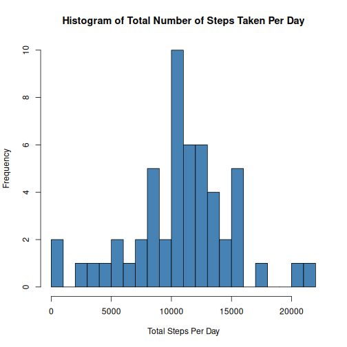
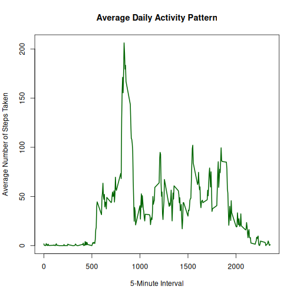
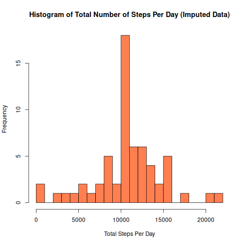
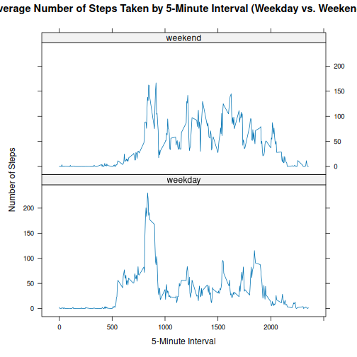

## 1. Load the data

``` r
activity <- read.csv("activity.csv")
```

## 2. Process/transform the data

``` r
activity$date <- as.Date(activity$date, format = "%Y-%m-%d")
str(activity)
```

```
## 'data.frame':	17568 obs. of  3 variables:
##  $ steps   : int  NA NA NA NA NA NA NA NA NA NA ...
##  $ date    : Date, format: "2012-10-01" "2012-10-01" "2012-10-01" "2012-10-01" ...
##  $ interval: int  0 5 10 15 20 25 30 35 40 45 ...
```


``` r
library(dplyr)
```

### Steps Taken Per Day

``` r
steps_per_day <- activity %>%
  filter(!is.na(steps)) %>%
  group_by(date) %>%
  summarize(total_steps = sum(steps))

head(steps_per_day)
```

```
## # A tibble: 6 × 2
##   date       total_steps
##   <date>           <int>
## 1 2012-10-02         126
## 2 2012-10-03       11352
## 3 2012-10-04       12116
## 4 2012-10-05       13294
## 5 2012-10-06       15420
## 6 2012-10-07       11015
```


``` r
hist(steps_per_day$total_steps, 
     breaks = 20, 
     col = "steelblue", 
     main = "Histogram of Total Number of Steps Taken Per Day", 
     xlab = "Total Steps Per Day", 
     ylab = "Frequency")
```




``` r
mean_steps <- mean(steps_per_day$total_steps)
median_steps <- median(steps_per_day$total_steps)

mean_steps
```

```
## [1] 10766.19
```

``` r
median_steps
```

```
## [1] 10765
```

### Average Daily Activity Pattern

``` r
avg_steps_interval <- activity %>%
  filter(!is.na(steps)) %>%
  group_by(interval) %>%
  summarize(mean_steps = mean(steps))

plot(avg_steps_interval$interval, avg_steps_interval$mean_steps,
     type = "l", 
     col = "darkgreen", 
     lwd = 2,
     main = "Average Daily Activity Pattern", 
     xlab = "5-Minute Interval", 
     ylab = "Average Number of Steps Taken")
```




``` r
max_interval_row <- avg_steps_interval %>%
  filter(mean_steps == max(mean_steps))

max_interval_row
```

```
## # A tibble: 1 × 2
##   interval mean_steps
##      <int>      <dbl>
## 1      835       206.
```

### Imputing Missing Values

``` r
total_nas <- sum(is.na(activity$steps))
total_nas
```

```
## [1] 2304
```


``` r
activity_imputed <- activity %>%
  left_join(avg_steps_interval, by = "interval") %>%
  mutate(steps = ifelse(is.na(steps), mean_steps, steps)) %>%
  select(-mean_steps)

sum(is.na(activity_imputed$steps))
```

```
## [1] 0
```


``` r
steps_per_day_imputed <- activity_imputed %>%
  group_by(date) %>%
  summarize(total_steps = sum(steps))

hist(steps_per_day_imputed$total_steps, 
     breaks = 20, 
     col = "coral", 
     main = "Histogram of Total Number of Steps Per Day (Imputed Data)", 
     xlab = "Total Steps Per Day", 
     ylab = "Frequency")
```




``` r
mean_steps_imp <- mean(steps_per_day_imputed$total_steps)
median_steps_imp <- median(steps_per_day_imputed$total_steps)

mean_steps_imp
```

```
## [1] 10766.19
```

``` r
median_steps_imp
```

```
## [1] 10766.19
```

### Weekdays vs. Weekends

``` r
activity_imputed <- activity_imputed %>%
  mutate(day_type = as.factor(ifelse(weekdays(date) %in% c("Saturday", "Sunday"), "weekend", "weekday")))

table(activity_imputed$day_type)
```

```
## 
## weekday weekend 
##   12960    4608
```


``` r
library(lattice)
```


``` r
avg_steps_by_day_type <- activity_imputed %>%
  group_by(interval, day_type) %>%
  summarize(mean_steps = mean(steps), .groups = 'drop')

xyplot(mean_steps ~ interval | day_type, data = avg_steps_by_day_type, 
       type = "l", 
       layout = c(1, 2), 
       main = "Average Number of Steps Taken by 5-Minute Interval (Weekday vs. Weekend)",
       xlab = "5-Minute Interval", 
       ylab = "Number of Steps")
```


